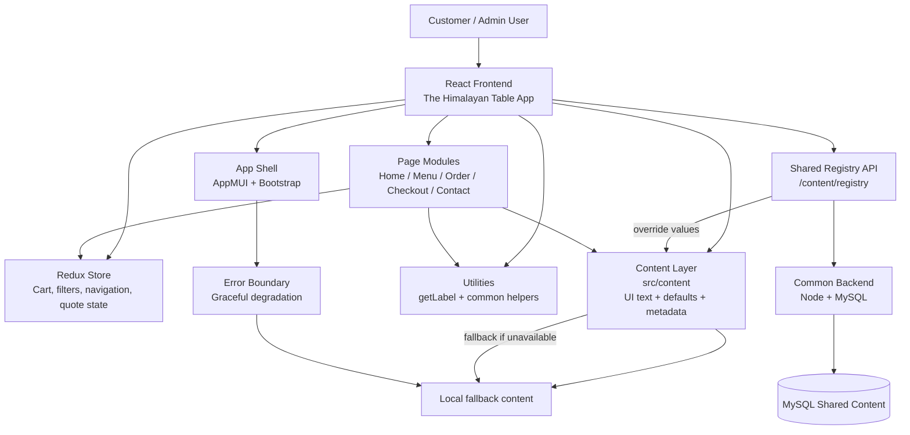

# The Himalayan Table

A React + TypeScript storefront and catering app for The Himalayan Table, built with MUI and a centralized content registry model.



## High-level application architecture

The application is organized around a few core layers:

- Frontend shell: React entry point, app layout, navigation orchestration, and global error handling.
- Shared content layer: centralized UI copy, metadata, validation text, and default form values under src/content.
- Redux state layer: store, reducers, actions, and typed selectors for navigation, cart, filters, and order state.
- Page modules: MUI-based screens for Home, Menu, Contact, Checkout, and Corporate Catering.
- Shared backend registry: a content API that stores override labels and shared registry data, while the frontend falls back to local content when the backend is unavailable.

## Folder structure

```text
src/
  AppMUI.tsx                           # top-level app shell and navigation
  bootstrap.tsx                        # React bootstrap with Provider and ErrorBoundary
  ErrorBoundary.tsx                    # app-level error protection
  store.ts                             # Redux Toolkit store and typed hooks
  types.ts                             # shared TypeScript interfaces
  content/
    common-content.ts                  # centralized UI constants and static content
    data.ts                            # menu and catering data
  pages/
    HomePageMUI.tsx                    # landing page
    MenuPageMUI.tsx                    # filtering and menu listing
    OrderFlowPageMUI.tsx               # ordering process flow
    CheckoutPageMUI.tsx                # checkout and summary
    ContactPageMUI.tsx                 # contact info and form shell
    CorporateCateringPageMUI.tsx       # corporate quote request flow
    CartDrawerMUI.tsx                  # cart drawer UI
  utils/
    getLabel.ts                        # registry hydration and label resolution
    common-helpers.ts                  # shared helper logic
  theme/
    theme.ts                           # MUI theme and branding
```

## Content registry model

Most UI constants are centralized in src/content/common-content.ts. This includes:

- navigation labels and app brand copy
- home, menu, checkout, contact, and corporate text
- validation messages and form defaults
- accessibility text and alt text metadata
- contact and brand configuration

At runtime, the app tries to hydrate content from the backend registry endpoint:

```text
GET /api/pms_tms/v1/content/registry
```

If the registry is available, server-provided values override the local defaults. If the backend is temporarily offline, the app continues to render from the local content model and surfaces a fallback notice instead of crashing.

## State and data flow

The frontend uses Redux Toolkit as the application state layer. State includes:

- active navigation section
- selected menu category and dietary filter
- cart items and quantities
- order flow selections and quote request details

This keeps page components focused on view rendering while the store owns customer flow state and cross-page interactions.

## Rendering and hydration flow

1. bootstrap.tsx mounts the app with Redux and the Error Boundary.
2. AppMUI initializes the shell and triggers registry hydration.
3. getLabel.ts resolves labels by merging local content with backend overrides.
4. Page components consume shared content and Redux state for rendering.
5. Registry updates trigger a re-render so new content appears without reloading the app.

## Error handling and resilience

The app is designed to degrade gracefully:

- React render errors are handled by the Error Boundary.
- Registry fetches retry a few times before falling back.
- Local content remains available when the shared registry is unavailable.

## Local development

```bash
cd frontend/the-himalayan-table
npm install
npm start
```

## Production build

```bash
cd frontend/the-himalayan-table
npm run build -- --mode production
```

## Backend integration

The shared registry is served by the backend application in the common layer:

```text
common/backend
```

The registry API is the source of shared content overrides for the storefront and catering experience.

## Summary

This project follows a content-driven architecture: most UI labels live in a centralized content module, while state and behavior remain in Redux and page components. That structure makes the app easier to localize, safer to maintain, and more resilient when the backend is temporarily unavailable.